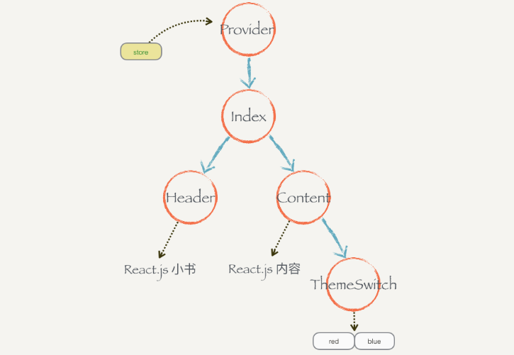

## 第一步:初始化工程  
回顾之前遇到的状态管理状态提升的问题：一个状态可能被多个组件依赖或者影响，而reactjs没有提供好的解决办法，只能把状态提升到依赖或者影响这个状态所有组件的公共父组件上，context可以将共享状态放到父组件上，父组件下的所有组件可以从context中直接获取状态而不需要一层层进行传递，并且所有组件都可以修改context里面的状态，容易导致运行的不可预料。  
把context和store结合起来，可以解决这些问题。

## 第二步：结合context和store的实现
## 第三步：connect和mapStateToProps 
Dumb纯组件，类似于纯函数  
connect高阶组件，把dumb和context连接起来

## 第四步：mapDispatchToProps
我们给connect传入这个参数来触发dispatch

## 第五步：Provider  
为什么要写个Provider组件？  
因为在indexjs中代码是被context污染的，我们提升出一个provider组件存放store，并将其设为根节点，这样所有的子组件都可以获取到context了。  
  
Provider的作用，把嵌套的内容原封不动作为自己组件渲染，把外界传给他的store放到context中。  
## 第六步：总结   
为什么要结合react和redux?
Reactjs除了状态提升以外没有更好的办法解决组件之间的共享状态问题，而使用context全局变量让程序不可预测，通过Redux章节我们知道store的内容必须通过dispatch修改，所以尝试将store和context结合起来使用，可以解决状态共享和被任意修改的问题。  

第一个版本store和context结合有许多缺陷，有大量重复逻辑和对context依赖性过强，然后尝试通过高阶组件connect函数的方式，吧重复逻辑和对context的依赖放在connect函数里，其他组件保持Dumb状态，让connect跟context打交道，通过props把参数传给普通的组件。  

每个组件需要的数据和需要出发的action不一样，所以调整connect让它接受两个参数。  
最后把所有关于context的代码从业务逻辑里面清除，构建一个Provider组件，作为所有组件树的根节点，外界可以通过props给它提供store，存到自己的context里，让子组件connect的时候都能获取到。  

